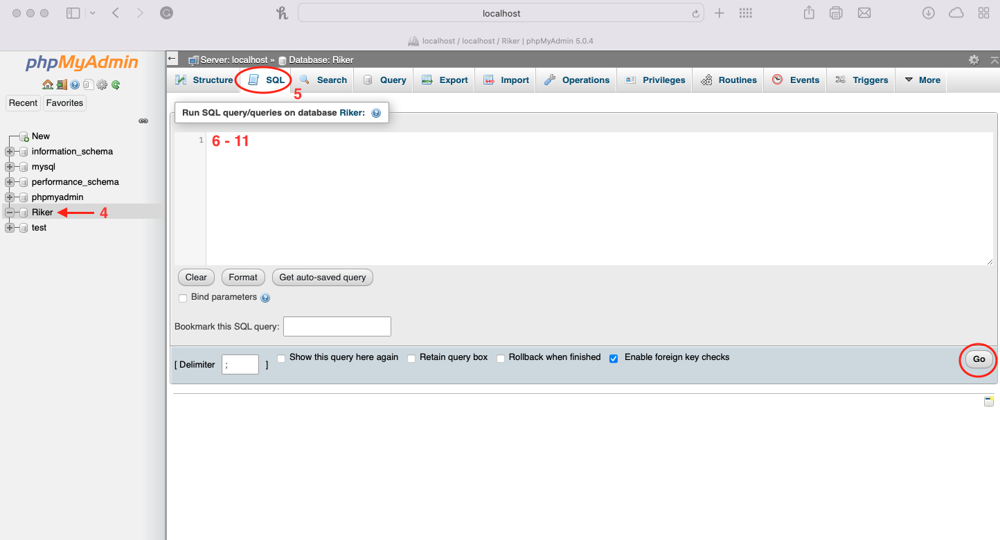

# ENSE 374 Group Project
## Team Riker

### Description
Group Project done by University of Regina's Software Engineering Students for ENSE 374: Software Engineering Management class in the FALL 2021 semester. This project was assigned by Dr. Tim Maciag and is being completed under his supervision.

### Group Members
Team consists of Software Engineering Students from the University of Regina
1. Archisha Bhattacharya
2. Bulbul Arora
3. Yixu Zhou

### Content
This repository consists of the project files relating to Team Riker's Group Project.

- [Vlogs](https://www.youtube.com/playlist?list=PL8BedSY240vubMrNiGZVit0FEH2b96TPz)

**Project Prerequisites and Planning**
- [Documentation](https://github.com/archishab/Team-Riker/tree/main/Project%20Prerequisites%20and%20Planning/Documentation)

**Project Design Architecture**
- [Prototypes](https://github.com/archishab/Team-Riker/tree/main/Project%20Design%20Architecture/Prototypes)
- [UML DIagrams](https://github.com/archishab/Team-Riker/tree/main/Project%20Design%20Architecture/UML%20Diagrams)
- [MVC Diagram](https://github.com/archishab/Team-Riker/blob/main/Project%20Design%20Architecture/MVC%20Architecture%20Diagram.pdf)

## Installation Requirements and Instructions
**Using XAMPP (localhost)**
> **Recommended OS: Windows, MacOS, Linux**


1. Type in the following command in your terminal to download the files from the repository to your device
```
git clone https://github.com/archishab/Team-Riker
```
2. Download the appropiate XAMPP installer for your OS from: [XAMPP](https://www.apachefriends.org/download.html)
4. Once downloaded and installed, open XAMPP and start "Apache" and "MySQL."
5. Navigate to `Team-Riker/Riker-Scheduling-App/MVP-code` in the repository folder you downloaded on your device.
6. Move all the files in the **'MVP-code'** directory to the the following folder:
    - **On MacOS:** `/Applications/XAMPP/xamppfiles/htdocs`
    - **On Windows:**  `C:\xampp\htdocs`

🔴 Note: There might be a index.php file already present in the folder. Please delete or rename that file before transferring the downloaded files.

6. Open the following link in your preferred browser: 
    - http://localhost/index.php

### Creating the required database
1. On a new tab visit `http://localhost/phpmyadmin`
2. Click on **'New'** from the right hand side pane to make a new database.
3. Name the database **'Riker'**.


4. Select **'Riker'** from the list of databases on right hand side pane.
5. Click on **'SQL'** from the top menu.
6. Enter the following query to make the 'User' database (also included in [user.sql](https://github.com/archishab/Team-Riker/blob/main/Riker-Scheduling-App/MySQL%20Queries/user.sql) file) and click on 'Go'
```
CREATE TABLE `user` (
 `user_id` int NOT NULL AUTO_INCREMENT,
 `username` varchar(30) NOT NULL,
 `email` varchar(30) NOT NULL,
 `password` varchar(10) NOT NULL,
 PRIMARY KEY (`user_id`)
) ENGINE=InnoDB AUTO_INCREMENT=11 DEFAULT CHARSET=utf8mb4
```
7. Enter the following query to make the 'Events' database (also included in the [events.sql](https://github.com/archishab/Team-Riker/blob/main/Riker-Scheduling-App/MySQL%20Queries/events.sql) file) and click on 'Go'
```
CREATE TABLE `events` (
 `user_id` int DEFAULT NULL,
 `event_id` int NOT NULL AUTO_INCREMENT,
 `title` varchar(30) NOT NULL,
 `course_name` varchar(30) NOT NULL,
 `type` varchar(30) NOT NULL,
 `due_date` date DEFAULT NULL,
 `due_time` time DEFAULT NULL,
 `description` varchar(500) DEFAULT NULL,
 `state` varchar(50) DEFAULT NULL,
 PRIMARY KEY (`event_id`),
 KEY `user_id` (`user_id`),
 CONSTRAINT `Events_ibfk_1` FOREIGN KEY (`user_id`) REFERENCES `User` (`user_id`)
) ENGINE=InnoDB AUTO_INCREMENT=19 DEFAULT CHARSET=utf8mb4
```
8. Enter the following query to make the 'Type' database (also included in the [type.sql](https://github.com/archishab/Team-Riker/blob/main/Riker-Scheduling-App/MySQL%20Queries/type.sql) file) and click on 'Go'
```
CREATE TABLE `Type` (
 `type_id` int NOT NULL,
 `name` varchar(15) NOT NULL,
 `types` varchar(15) NOT NULL,
 PRIMARY KEY (`type_id`)
)ENGINE=InnoDB DEFAULT CHARSET=utf8mb4
```
9. Enter the following query to add rows to the 'Type' database and click on 'Go'
```
INSERT INTO `Type` (`type_id`, `name`, `types`) VALUES ('1', 'Assignment', 'assignment'), ('2', 'Lab', 'lab'), ('3', 'Exam', 'exam') 
```
10. Enter the following query to make the 'State' database (also included in the [state.sql](https://github.com/archishab/Team-Riker/blob/main/Riker-Scheduling-App/MySQL%20Queries/state.sql) file) and click on 'Go'
```
CREATE TABLE `state` (
 `state_id` int NOT NULL,
 `name` varchar(15) NOT NULL,
 `states` varchar(15) NOT NULL,
 PRIMARY KEY (`state_id`)
) ENGINE=InnoDB DEFAULT CHARSET=utf8mb4
```
11. Enter the following query to add rows to the 'State' database and click on 'Go'
```
INSERT INTO `State` (`state_id`, `name`, `states`) VALUES ('1', 'To-Do', 'todo'), ('2', 'In Progress', 'inprogress'), ('3', 'Done', 'done') 
```


The site is now fully functional!
